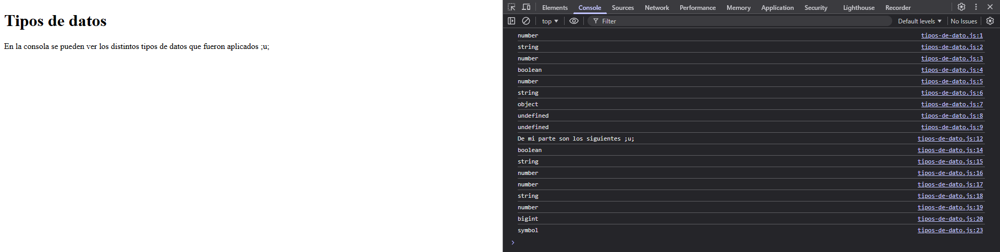

# Proyecto 1 - Introducción a Javascript

En este proyecto se practicó con los distintos tipos de datos que son importantes en JavaScript mediante ejemplos y comentarios

## Archivos del proyecto

- **tipos-de-dato.html**: Archivo HTML para probar el código en el navegador
- **tipos-de-dato.js**: Ejemplos de los diferentes tipos de datos en JavaScript
- **notas-clase.js**: Notas de la clase sobre tipos de datos
- **README.md**: Documentación y explicación del proyecto
- **img/Captura-datos.png**: Captura de pantalla del funcionamiento del programa en el navegador

## Tipos de datos vistos:

- **String** (cadenas de texto)
- **Number** (números)
- **Boolean** (verdadero/falso)
- **Null** (nulo)
- **Undefined** (no definido)
- **NaN** ("Not a Number")
- **BigInt** (números enteros grandes)
- **Symbol** (identificadores únicos)

## Evidencia visual

A continuación se muestra una captura de pantalla del código funcionando en la consola del navegador:



## Ejemplo de uso

Abra el archivo 
```tipos-de-dato.html```
en su navegador y revise la consola para ver los ejemplos y resultados

## Despliegue

Se desplegó en Github Pages a partir de este repositorio, puedes ver la página a través del siguiente link:

https://mor4n.github.io/introduccion-a-javascript-01.github.io/01-introducci%C3%B3n-a-javascript/tipos-de-dato.html


## Como conclusión final:
Cosas que pude notar:
- Un string va a ser string ya sea con comillas dobles o simples
- Sin importar de que sea positivo, negativo o decimal, siempre será number
- true y false son boolean y deben estar escritas en minúsculas, al escribirlas en mayúsculas, al ser JavaScript sensible con las mayúsculas y minusculas, tengo entendido que lo tomaría como una variable u otra cosa, por lo tanto, en ese caso daría undefined si pusieramos "FALSE", porque estaría buscando una variable que no existe
- null es un objeto, nosotros como programadores lo definimos como nulo
- NaN es "not a number", aunque "no es un número", su tipo es number
- undefined puede ser algo que no hemos definido o algo que el interprete no puede entender por así decirlo

También revisé estos dos que venían en la lección de tipos de datos:
- BigInt es cuando queremos un número muy grande, en la documentación de mozilla revisé que se podía aplicar o definir con "n" después del número
- Symbol a lo que revisé en la documentación, siento que es como para crear ID's o identificadores únicos o irrepetibles, la apliqué a una variable con Symbol()

## Fuentes
https://developer.mozilla.org/es/docs/Web/JavaScript/Reference/Global_Objects/BigInt
https://developer.mozilla.org/es/docs/Web/JavaScript/Reference/Global_Objects/Symbol
