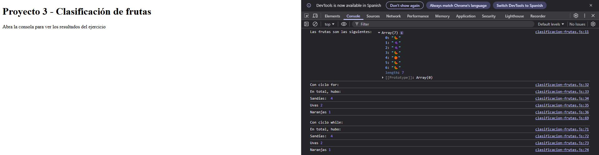

# Lección 3 - Arreglos y ciclos

En este proyecto se practicó con los distintos de ciclos, como el ciclo for y while, así como la estructura de datos conocida arreglo o matriz y sus diferentes formas tanto de acceder a los datos, como de manipular la información, ya sea agregando, eliminando u ordenando datos.

## Archivos del proyecto

- **index.html**: Archivo HTML para probar el código en el navegador
- **clasificacion-frutas.js**: Ejercicio realizado para la lección 3: Clasificación de frutas
- **README.md**: Documentación y explicación de la lección 3

- **ejemplos-clase**: Carpeta con notas y ejemplos de la clase sobre tipos de datos
- **ejemplos-clase/arreglos.js**: Notas y ejemplos acerca de los arreglos
- **ejemplos-clase/ciclo-for.js**: Notas y ejemplos acerca del ciclo for
- **ejemplos-clase/ciclo-while.js**: Notas y ejemplos acerca del ciclo while
- **ejemplos-clase/iterar_arreglo.js**: Notas y ejemplos acerca de como iterar un arreglo

- **img/Captura-frutas.png**: Captura de pantalla del funcionamiento del programa en el navegador

## Aprendizajes:
- Como utilizar el ciclo for y el ciclo while
- Que es un arreglo, para que sirve y como puedo usarlo
- Como puedo recorrer un arreglo
- Métodos de los arreglos (push, pop, unshift, shift, sort, map, incluso splice aunque no lo incluí en el archivo)
- Como usar el ciclo for y while para resolver el trabajo de clasificación de frutas de un arreglo, usando if-else para tomar la decisión de si es la fruta correcta y guardando en el contador la cantidad de frutas.


## Evidencia visual

A continuación se muestra una captura de pantalla del código funcionando en la consola del navegador:



## Ejemplo de uso

Abra el archivo 
```index.html```
en su navegador y revise la consola para ver los ejemplos y resultados

También puede mirar el código de JavaScript abriendo el archivo
```clasificacion-frutas.js```
dentro de su editor de código preferido o dentro de Github.

## Despliegue

Se desplegó en Github Pages a partir de este repositorio, puedes ver la página a través del siguiente link:

https://mor4n.github.io/introduccion-a-javascript-01.github.io/03-arreglos-y-ciclos/index.html


## Como conclusión final:
En esta lección pude aprender el uso de arreglos y ciclos en JavaScript mediante ejemplos prácticos que vimos en clase.
El ejercicio de clasificación de frutas me dio chance de aprender ya con mis propias manos el cómo recorrer un arreglo utilizando los ciclos que aprendimos que son el for y el while, también el como aplicar condicionales para procesar la información, que ahorita mismo es algo simple como comparar unos emojis, pero esto me podría dar paso al futuro para evaluar cosas más pesadas por así decirlo en la vida real.

