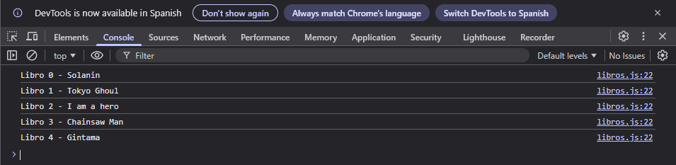

# Lección 4 - Funciones - Seguimiento de Libros

En este proyecto se practicó con funciones en Javascript, desde funciones normales, anónimas, de flecha, y la simplificación de las funciones de flecha, así como también se practicó con retos vistos en clase y con la práctica de seguimientos de libros.


## Archivos del proyecto

- **index.html**: Archivo HTML para probar el código en el navegador
- **libros.js**: Ejercicio realizado para la lección 4: Seguimiento de Libros
- **retos.js**: Retos vistos en clase
- **README.md**: Documentación y explicación de la lección 4

- **ejemplos-clase**: Carpeta con notas y ejemplos de la clase sobre tipos de datos
- **ejemplos-clase/funciones.js**: Notas y ejemplos acerca de las funciones
- **ejemplos-clase/alcance.js**: Notas y ejemplos acerca de los alcances o scope
- **ejemplos-clase/funciones_anonimas_flecha.js**: Notas y ejemplos acerca de las funciones anónimas y flecha

- **img/Captura.png**: Captura de pantalla del funcionamiento del programa en el navegador

## Aprendizajes:

- Que es una función y como declararla
- Diferencias entre las funciones normales, anónimas y de flecha
- Como simplificar una función de flecha
- El scope dentro y fuera de una función
- Práctica con el ejercicio de libros


## Evidencia visual

A continuación se muestra una captura de pantalla del código funcionando en la consola del navegador:



## Ejemplo de uso

Abra el archivo 
```index.html```
en su navegador y revise la consola para ver los ejemplos y resultados

También puede mirar el código de JavaScript abriendo el archivo
```libros.js```
dentro de su editor de código preferido o dentro de Github.

## Despliegue

Se desplegó en Github Pages a partir de este repositorio, puedes ver la página a través del siguiente link:

https://mor4n.github.io/introduccion-a-javascript-01.github.io/04-funciones/index.html


## Como conclusión final:

En esta lección pude aprender el como usar las funciones en Javascript, mediante ejemplos que vimos en clase y los retos que nos puso (que fueron algo retadores x-x pero pude aprender mucho!)

Por otro lado, en la práctica 4: declaré primero que nada el arreglo de libros en el scope global para que ambas funciones pudieran acceder y modificar su contenido.

En las funciones, las usé como funciones de flecha o arrow functions para empezar a acostumbrarme a usarlas, en la primer función que fue la de agregar libros, se usó como parametro "título", que vienen siendo los títulos de los libros que añadiríamos al llamar la función.
Dentro de esta función, se aplicó el método push del arreglo donde guardamos los libros, este método lo vimos en la clase anterior. En el push se agregará el título que tenemos como parámetro en la función, con ello, se agregará el título a nuestro arreglo de libros.

Por otro lado, para la función de consultar, se usó un ciclo for para recorrer el arreglo, mostrando en pantalla el valor del libro en base a la posición que en el que se esté en el ciclo for.
(De paso, quiero decir que para evitar usar "," al momento de concatenar en el console.log, encontré en el siguiente link: https://www.reddit.com/r/learnprogramming/comments/7r76yn/difference_between_and_in_js/?show=original y después en mozilla, que se pueden usar los "Template literals" que son estos: "``", al usar esos en vez de comillas o comillas dobles, puedo usar directamente las varialbes con ${}, fue algo que se me hizo super chido!)

Ya en la parte final, se mandó a llamar cada función:
- agregarLibros("tituloLibro") <- se agregó como parámetro el título del libro para que lo añadiera al arreglo
- mostrarLibrosLeido() <- se mandó a llamar para que imprimiera en consola todos los titulos de los libros.


## Fuentes
https://www.reddit.com/r/learnprogramming/comments/7r76yn/difference_between_and_in_js/?show=original
https://developer.mozilla.org/en-US/docs/Web/JavaScript/Reference/Template_literals

