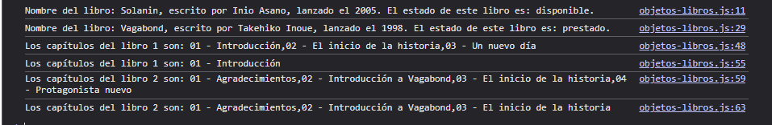

# Lección 5 - Objetos - Objeto a partir de un libro

En este lección se practicó con objetos en Javascript, desde aprender a crearlos, acceder a sus propiedades, modificarlos, recorrerlos como en el reto con objetos anidados y destructuración.


## Archivos del proyecto

- **index.html**: Archivo HTML para probar el código en el navegador
- **objetos-libros.js**: Ejercicio realizado para la lección 5: Objeto a partir de un libro
- **retos.js**: Retos vistos en clase
- **README.md**: Documentación y explicación de la lección 5

- **ejemplos-clase**: Carpeta con notas y ejemplos de vistos en clase sobre los objetos
- **ejemplos-clase/objetos.js**: Notas y ejemplos acerca de los objetos, desde como crearlos, su sintaxis, como usar los métodos, etc.
- **ejemplos-clase/iterar-objetos.js**: Notas acerca de la iteración de objetos
- **ejemplos-clase/objetos-anidados-destructuracion.js**: Notas y ejemplos acerca de la destructuración de un objeto y como funcionan los objetos anidados


- **ejemplos-mios**: Carpeta con notas y ejemplos que pude aprender sobre los objetos
- **ejemplos-mios/ejemplosobjetos.js**: Notas acerca de como eliminar propiedades de objetos y como copiar un objeto o unirlos a una variable.

- **img/Captura.png**: Captura de pantalla del funcionamiento del programa en el navegador

## Aprendizajes:

- Qué es un objeto en JavaScript y cómo declararlo
- Cómo acceder, modificar y eliminar propiedades de un objeto
- El como usar métodos dentro de objetos
- Como copiar un objeto
- Objetos anidados y como se puede acceder a sus propiedades
- Destructuración de objetos para obtener datos y guardarlos en su propia variable
- Recorrido de objetos con for in


## Evidencia visual

A continuación se muestra una captura de pantalla del código funcionando en la consola del navegador:



## Ejemplo de uso

Abra el archivo 
```index.html```
en su navegador y revise la consola para ver los ejemplos y resultados

También puede mirar el código de JavaScript abriendo el archivo
```objetos.js```
dentro de su editor de código preferido o dentro de Github.

## Despliegue

Se desplegó en Github Pages a partir de este repositorio, puedes ver la página a través del siguiente link:

https://mor4n.github.io/introduccion-a-javascript-01.github.io/05-objetos/index.html


## Como conclusión personal:

En esta lección pude aprender a como usar objetos en Javascript, desde su declaración hasta incluso el poder usar objetos anidados y la destructuración.
La práctica en sí fue muy parecido a lo que veníamos haciendo anteriormente así que siento que no fue tan complicado de realizar.
El punto complicado de realizar fue el reto propuesto en clase, no los primeros 2, sino el último que fue de tarea, y tampoco tanto en la parte de país, sino en la parte de estados JAJAJA.
Para esta parte, me sacó bastante de onda porque dije yo "está en el mismo nivel estados y ciudad" y fue lo que me mató por un montón de tiempo x-x porque en un inicio traté de hacer lo que venía haciendo atrás, tipo  for (estado in this.continentes[continente][pais]), algo asi parecido pero no me salió JAJAJA, al final del día, lo que se hizo fue primero, como que hacer la limitante o condición "tengo la propiedad estado?" si es así, entonces hay que recorrer el arreglo ( y me sirvió doble porque ya con eso, se pudo hacer el otro pedacito de ciudad )


