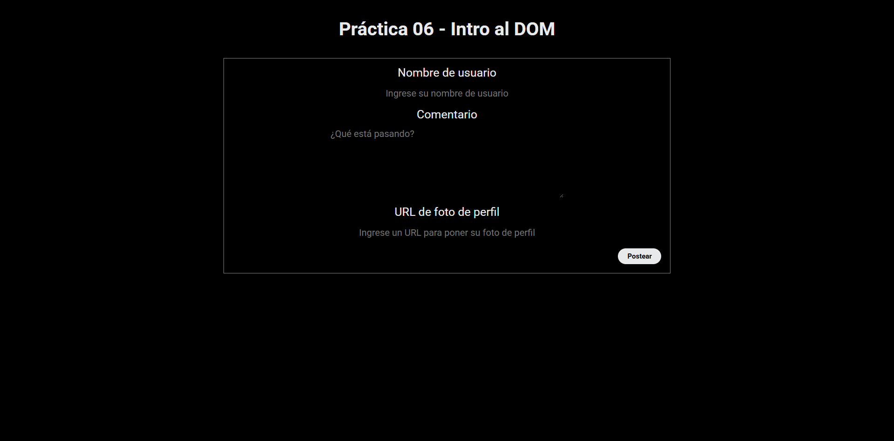

# Lección 6 - Introducción al DOM: Caja de Comentarios (Simple Comment Box)


## Archivos del proyecto

- **index.html**: Archivo HTML donde está la base de la práctica de la lección 6: Caja de Comentarios (Simple Comment Box)
- **script.js**: Archivo de Javascript con la funcionalidad para realizar la caja de comentarios
- **style.cs**: Archivo de CSS con el diseño del index.html
- **README.md**: Documentación y explicación de la lección 6

- **ejemplos-clase**: Carpeta con notas y ejemplos de vistos en clase sobre
- **ejemplos-clase/index.html**: Archivo base para poder ejecutar el script.js
- **ejemplos-clase/script.js**: Notas acerca del DOM en javascript vistos en clase

- **hola_dom**: Carpeta con notas del ejemplo de "Hola usuario" con el DOM y javascript
- **hola_dom/index.html**: Archivo HTML base para ejecutar el script.js
- **hola_dom/script.js**: Archivo de Javascript con la funcionalidad para modificar el DOM

- **ejemplos-clase/index.html**: Archivo base para poder ejecutar el script.js
- **ejemplos-clase/script.js**: Notas acerca del DOM en javascript vistos en clase

- **img/Captura.png**: Captura de pantalla del funcionamiento del programa en el navegador

## Aprendizajes:


## Evidencia visual

A continuación se muestra una captura de pantalla del código funcionando en la consola del navegador:



## Ejemplo de uso

Abra el archivo 
```index.html```
en su navegador y revise el sitio web para probar la funcionalidad del mismo

También puede mirar el código de JavaScript abriendo el archivo
```script.js```
dentro de su editor de código preferido o dentro de Github.

## Despliegue

Se desplegó en Github Pages a partir de este repositorio, puedes ver la página a través del siguiente link:
https://mor4n.github.io/introduccion-a-javascript-01.github.io/06-introduccion-al-dom/index.html


## Como conclusión personal:


## Fuentes:
https://developer.mozilla.org/en-US/docs/Web/API/HTMLFormElement/submit_event
https://developer.mozilla.org/en-US/docs/Web/API/Element/setAttribute
https://developer.mozilla.org/en-US/docs/Web/API/Element/remove
https://stackoverflow.com/questions/4744299/how-to-get-datetime-in-javascript