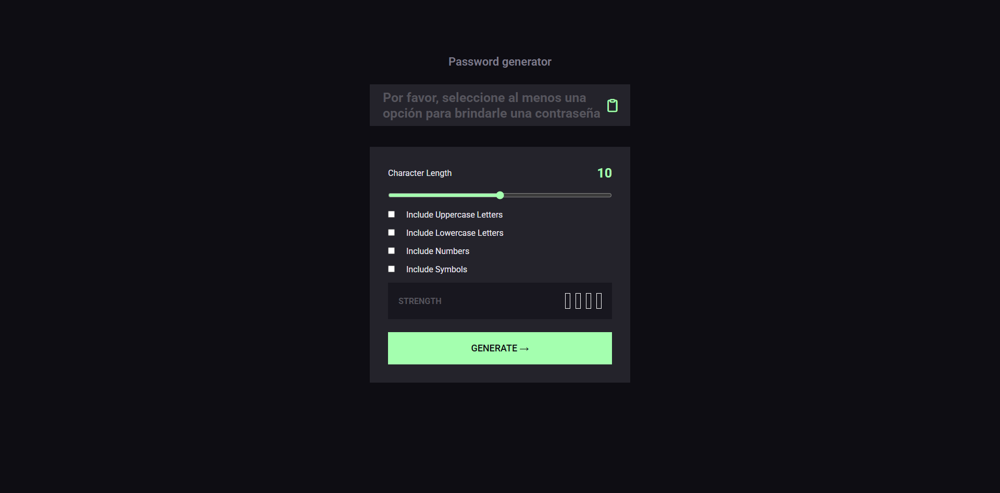
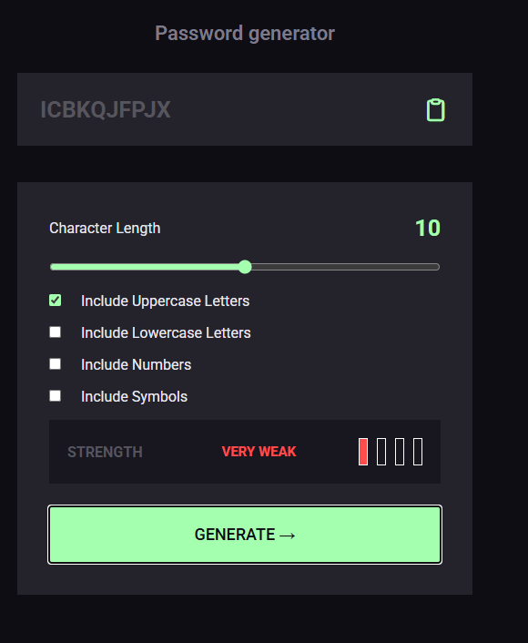
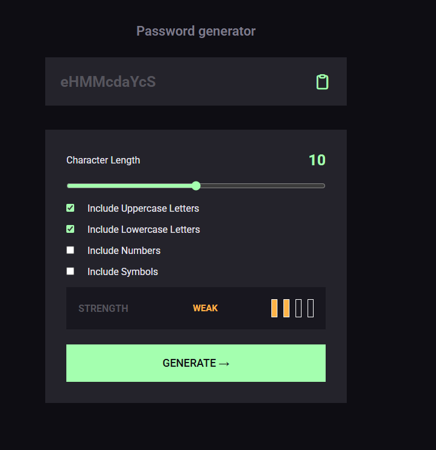
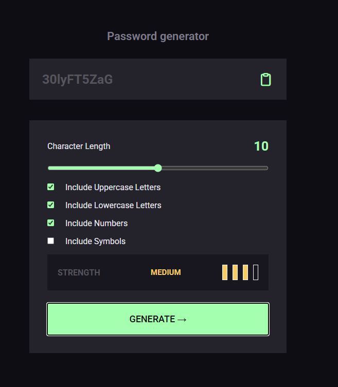
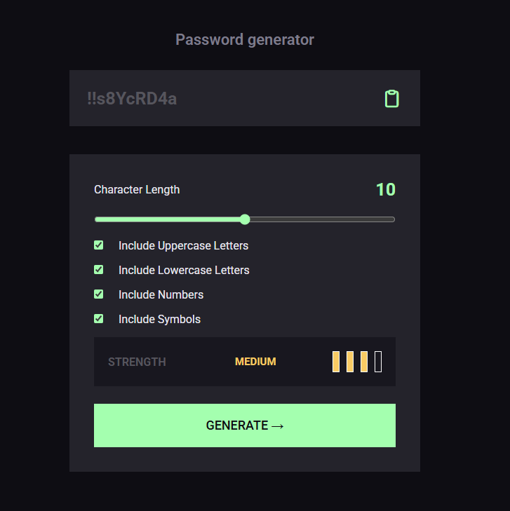
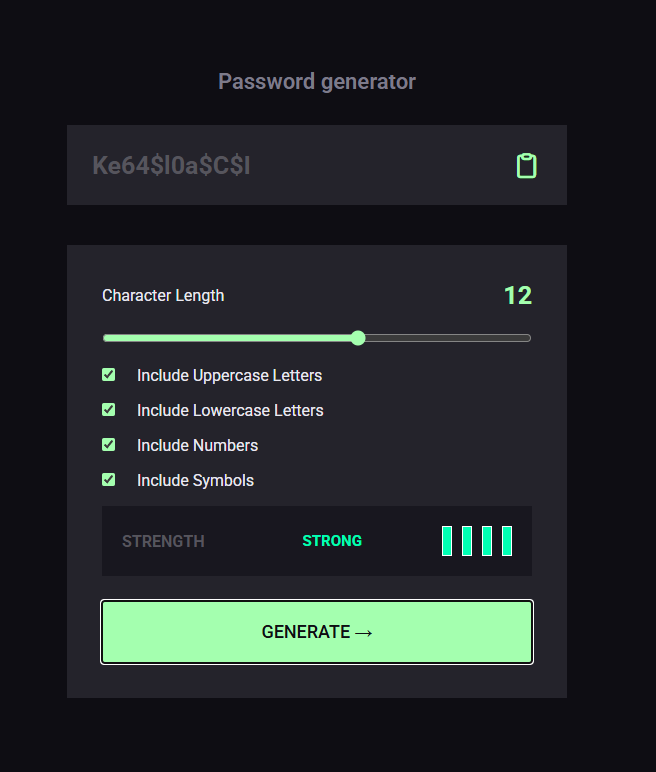
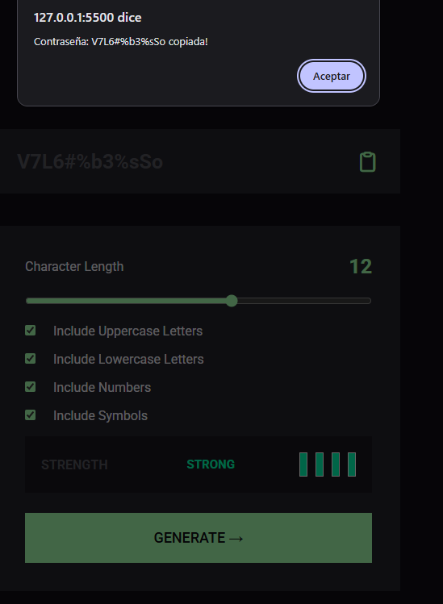

# Lección 7 - Dominando el DOM: Generador de contraseñas

En este lección se practicó con más detalle el DOM en Javascript con un generador de contraseñas.


## Archivos del proyecto

- **generador_de_passwords**: Carpeta con la práctica de la lección 7 - Generador de contraseñas
- **generador_de_passwords/index.html**: Archivo HTML del proyecto, contectando el script.js y el style.css
- **generador_de_passwords/script.js**: Archivo de Javascript con la funcionalidad del proyecto
- **generador_de_passwords/style.css**: Archivo de CSS con los estilos del proyecto

- **img/Captura.png**: Captura de pantalla inicial


## Aprendizajes:

- Modificación de CSS con Javascript 
- Usar eventListener con inputs como range
- Uso del random
- Miniuso de promesas para el copiar contraseña
- Reforzamiento en cuanto al DOM con Javascript


## Evidencia visual

A continuación se muestra una captura de pantalla del código funcionando en la consola del navegador:











## Ejemplo de uso

Abra el archivo 
```generador_de_passwords/index.html```
en su navegador y revise el sitio web para probar la funcionalidad del mismo

También puede mirar el código de JavaScript abriendo el archivo
```generador_de_passwords/script.js```
dentro de su editor de código preferido o dentro de Github.

## Despliegue

Se desplegó en Github Pages a partir de este repositorio, puedes ver la página a través del siguiente link:
https://mor4n.github.io/introduccion-a-javascript-01.github.io/07-dominando-el-dom/generador_de_passwords/index.html


## Como conclusión personal:

En esta práctica siento que pude aprender DEMASIADO de verdad, en un inicio siento que fue como "chale, ¿qué hago? ¿dónde empiezo?", pero fue un poquito como descomponer el problema por pedacitos.
- Tener un array donde guarda todas las mayusculas, minusculas, numeros y simbolos.
El problema me imaginé para resolverlo algo como esto:
- Siento que debo tener otro array, en este array tendrá un tamaño fijo, por ejemplo, si la longitud es de 15, quiero que tenga 15 espacios vacíos.
- Para que sea totalmente aleatoria, quiero que se obtenga una posición random del arreglo de la contraseña que esté vacío, en esa posición:
    - (espero que no suene engorroso por mi redacción) Quiero de mayusculas se obtenga una letra aleatoria, por ello, al array de mayusculas le voy a obtener una posición aleatoria en base al tamaño de su arreglo.
        - En la posición aleatoria vacía de mi arreglo de contraseña, voy a añadirle la letra al acceder al arreglo de mayusculas en la posición aleatoria que obtuve anteriormente
Este ciclo lo quiero repetir hasta que esté completamente lleno el arreglo de contraseñas
Luego, este arreglo de contraseña, lo quiero juntar en un solo texto para mostrarlo en el HTML
Con esto lo tengo la contraseña de forma totalmente aleatoria, o sea, cualquier posición podría tener cualquier valor, ya sea mayuscula, minuscula, numero o simbolo.

Para hacerlo primero hice validaciones, como si había seleccionado al menos un checkbox, porque si no, no se podría generar, y también el que sea mayor a 8 letras por la restricción de la tarea.
Si cumplió con lo anterior, se empieza con el proceso de la generación de la contraseña y es que tengo un contador general para ir cambiando de proceso por así decirlo (primero mayusculas, luego minusculas, numeros y simbolos)

Tengo una función que es para obtener las posiciones vacias del arreglo que es de la contraseña, yo le paso el arreglo de la contraseña actual como parametro. Esta función guarda las posiciones vacias en un arreglo, las cuales, se llenaran por medio de un ciclo for que recorrerá el arreglo de la contraseña.
Si encuentra un "undefined" (que así sale al momento que creo el arreglo con cierta longitud ;u;) entonces, esa posición guardala en el arreglo de posiciones vacias.
Cuando acabes de recorrerlo, si la longitud del arreglo es igual a cero, quiere decir que no existen posiciones vacias, por lo tanto, devuelve un null, de lo contrario, entonces, en base al tamaño del arreglo de posiciones vacias, obtén una posición aleatoria (tipo, el indice). Del arreglo de posiciones vacias que existen en mi arreglo de contraseñas (que está en orden), voy a devolver una posicion aleatoria vacía para que más adelante, pueda ingresarle un dato aleatorio.

Esto lo digo porque tengo un ciclo while, el cual primero que nada, va a verificar que lo devuelto por la función que dije anteriormente, no será null, si es null, quiere decir que el arreglo de contraseña ya fue llenado, si no ha sido llenado, entonces verifico que checkbox están en true.

Lo pensé como que 0 es el inicio y es para mayusculas, el 1 es para minusculas, 2 para numeros, 3 para simbolos.

Si el contador está en cero y no está activado el checkbox de mayusculas, entonces quiero que aumente en uno para que pueda pasar a procesar minusculas, si no está el checkbox de minusculas activado, quiero que aumente en uno para que verifique los numeros y así... esto sucede al inicio como validación.

Después de esto, ahora si, se empieza hace como que el procesamiento, si el contador es 0 y está activado el checkbox de mayusculas, que se obtenga una posición vacía con la función que dije hace ratito, (puse un segundo para validar el empty position por si llegara a pasar algo y que no se cicle infinitamente pq me paso y se me trabó la compu q-q).
En una variable, voy a guardar una posición aleatoria del arreglo de mayusculas, en base al tamaño del arreglo de mayusculas.

Luego, en el arreglo de la contraseña, puse de índice la posición random vacía generada por la función, y el valor que va a ser asignado, será una letra del arreglo de mayusculas, cuyo índice será la posición aleatoria que acabamos de poner en la variable.

Con esto, ya tengo una letra aleatoria en una posición aleatoria del arreglo (PERDÓN DE VERDAD SI ESTUVO ENGORROSO), ya solo se aumentó la posición en 1 para ahora continuar con las minusculas, en el cual, solo cambia el arreglo por las minusculas y se aumenta en 1 para continuar con numeros y para finalizar, cuando se llega a simbolos, el valor del contador se reinicia en 0, para que pueda volver a generar un valor en mayusculas y se repita el ciclo.

Luego, el arreglo lo junto con el método .join y lo guardo en una variable password y este lo  mando a una función que es para validar la seguridad de la contraseña, en esta tengo otro contador de checkbox, donde se suma en 1 por cada checkbox que esté en true (todos tienen el mismo peso), y en este caso, puse los siguientes valores de verificación de seguridad
- Fuerte: Longitud es mayor o igual a 15 y tiene todos los checkbox
- Medio: Longitud es mayor o igual a 12 y tiene 3 checkbox activados
- Débil: Tiene 2 checkbox activados
- Múy débil: Si solo tiene un checkbox activado
En cada uno se cambia el color de fondo de unas barritas que hice con grid y se le cambia el texto con innerHTML al que le corresponde, junto con su respectivo color de texto.

Otra cosa que me pasó fue que a veces los colores se me quedaban, por ejemplo, ponia el fuerte que rellena todas las barras y ponia uno medio, se quedaban las barras verdes, por ello, cuando mando a llamar para generar una contraseña, antes de validar si lo que ingresé es válido o no, mando a llamar a una función que resetee los colores de cada barrita y del texto de nivel de seguridad.

Por último, para copiar la contraseña, le añadí un event listener y a lo que entendí de la documentación de mozilla, es de promesas, pero no terminé de entender del todo como funcionaba, asi que en stack overflow encontré un ejemplo y lo apliqué para copiar la contraseña del elemento password del html, mostrando un mini popup con alert indicando que fue copiada la contraseña.

Estoy más o menos feliz con el resultado ;n; si bien, usé la IA para apoyarme en cosas como para intentar entender lo del clipboard un poco más y una que otra cosa como el bucle infinito, me queda buen sabor de boca por el lado de que la mayor parte de la lógica fue mia y REALMENTE pude aplicar todo lo que he aprendido en clases ;u; pero siento un horrible sabor de boca porque siento que hice un espagueti horrible, pero más adelante intentaré buscar otras formas de hacerlo u.u
Muchas gracias de verdad y perdón por todo el texto


## Fuentes:
https://developer.mozilla.org/en-US/docs/Web/JavaScript/Reference/Global_Objects/Array/Array
https://developer.mozilla.org/en-US/docs/Web/JavaScript/Reference/Global_Objects/Math/random
https://developer.mozilla.org/en-US/docs/Web/JavaScript/Reference/Global_Objects/Array/join
https://stackoverflow.com/questions/69606670/javascript-add-eventlistener-to-all-input-with-type-range <- Con el comentario que vi de la persona de la respuesta, vi que tenia "change" y le puse así a ver si agarraba y agarró o-o
https://developer.mozilla.org/en-US/docs/Web/API/HTMLElement/change_event
https://developer.mozilla.org/en-US/docs/Web/API/Clipboard/writeText <- no me salió el ejemplo y tuve que buscar en stackoverflow
https://stackoverflow.com/questions/69438702/why-does-navigator-clipboard-writetext-not-copy-text-to-clipboard-if-it-is-pro 
https://stackoverflow.com/questions/197748/how-do-i-change-the-background-color-with-javascript
https://stackoverflow.com/questions/62943565/change-colour-of-input-type-range-bar-in-css