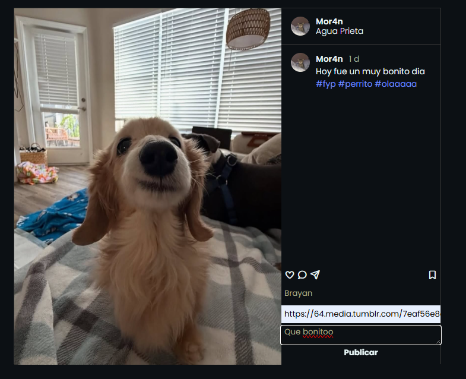
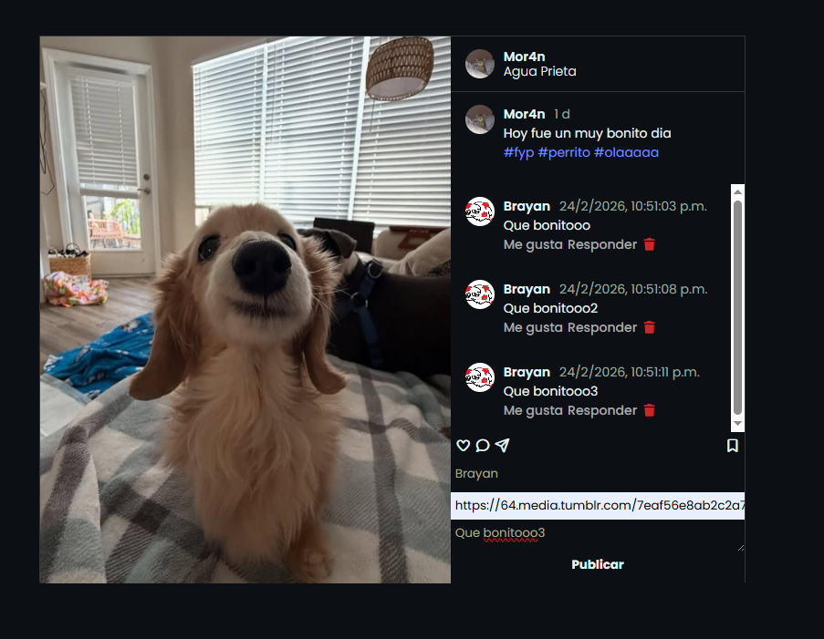
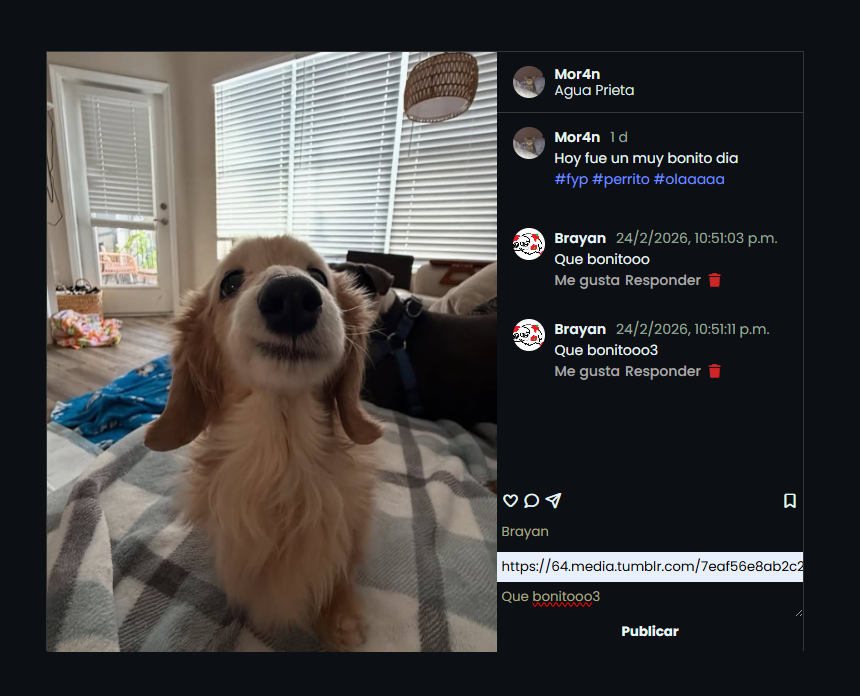

# Lección 8 - Proyecto final: Caja de comentarios
En este proyecto final se realizó una caja de comentarios, en el cual, los usuarios pueden agregar comentarios por medio de inputs, los cuales se añadirán en la página.


## Archivos del repositorio

- **./caja_comentarios/index.html**: Archivo HTML del proyecto, contectando el script.js y el style.css
- **./caja_comentarios/script.js**: Archivo de Javascript con la funcionalidad del proyecto
- **./caja_comentarios/style.css**: Archivo de CSS con los estilos del proyecto

- **./local_storage**: Carpeta con ejemplo de local storage visto en clase

- **img/Captura1.png**: Captura de pantalla inicial
- **img/Captura2.png**: Captura con datos en los inputs
- **img/Captura3.png**: Captura con comentarios añadidos
- **img/Captura4.png**: Captura con comentario 2 eliminado


## Aprendizajes:

- Reforzamiento en cuanto al uso de la manipulación del DOM con Javascript
- Reforzamiento en cuanto al uso de flexbox al momento de tratar de hacer un mini clon de instagram
- El uso de localstorage con Javascript


## Evidencia visual

A continuación se muestra una captura de pantalla del código funcionando en la consola del navegador:







## Ejemplo de uso

Abra el archivo 
```./caja_comentarios/index.html```
en su navegador y revise el sitio web para probar la funcionalidad del mismo

También puede mirar el código de JavaScript abriendo el archivo
```./caja_comentarios/script.js```
dentro de su editor de código preferido o dentro de Github.

## Despliegue

Se desplegó en Github Pages a partir de este repositorio, puedes ver la página a través del siguiente link:
https://mor4n.github.io/introduccion-a-javascript-01.github.io/08-proyecto-final/caja_comentarios/index.html


## Como conclusión personal:

Para este proyecto apliqué lo que vimos en la lección 06: Introducción al DOM de caja de comentarios, para intentar darle otro mini toque, traté de hacer un mini clon de la parte de comentarios de Instagram, se usó ahora classList para añadir las clases a diferencia de como lo hice en esa lección y textContent en lugar de innerHTML (aunque este último lo usé para añadir el ícono de bote de basura), también añadí íconos con FontAwesome, siendo que todos los íconos son del plan gratuito de ahí :'D!
